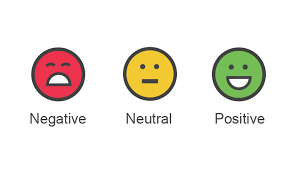

# Data Science Portfolio
---
## Machine learning

### Sentiment_Analysis

simple web app which interacts with a deployed recurrent neural network performing sentiment analysis on movie reviews. This project assumes some familiarity with SageMaker, the mini-project, Sentiment Analysis using XGBoost, should provide enough background.

---
### Starbucks

This is just a collection of topics and algorithms that in my opinion are interesting.

mimics customer behavior on the Starbucks rewards mobile app. Once every few days, Starbucks sends out an offer to users of the mobile app. An offer can be merely an advertisement for a drink or an actual offer such as a discount or BOGO (buy one get one free). Some users might not receive any offer during certain weeks.

---
### Plagiarism_Detection

a plagiarism detector that examines an answer text file and performs binary classification; labeling that file as either plagiarized or not, depending on how similar that text file is to a provided, source text.

---
